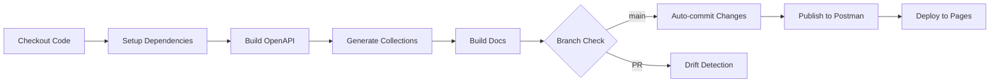

# C2M API V3 - Comprehensive Documentation

## Table of Contents
- [Overview](#overview)
- [Architecture](#architecture)
- [🎯 RECOMMENDED: Template Endpoints](#-recommended-template-endpoints-use-these-first)
- [Template Endpoints Quick Start](#template-endpoints-quick-start)
- [Directory Structure](#directory-structure)
- [Prerequisites](#prerequisites)
- [Quick Start](#quick-start)
- [What's New](#whats-new)
- [Postman Integration Guide](#postman-integration-guide)
- [Core Workflows](#core-workflows)
- [Configuration](#configuration)
- [Development Guide](#development-guide)
- [API Endpoints](#api-endpoints)
- [Testing](#testing)
- [Deployment](#deployment)
- [CI/CD Pipeline (GitHub Actions)](#cicd-pipeline-github-actions)
- [Makefile Documentation](#makefile-documentation)
- [Troubleshooting](#troubleshooting)
- [Debugging Playbook](#debugging-playbook)
- [Contributing](#contributing)

---

## Overview

The C2M API V3 is a comprehensive document submission and mail processing API that automates the workflow from data modeling to deployment. The project uses an innovative pipeline that converts EBNF data dictionaries to OpenAPI specifications, generates Postman collections for testing, and provides both cloud and local mock servers for development.

### Key Features

- **Automated API Specification Generation**: Converts EBNF data models to OpenAPI 3.0 specifications
- **Template-First Design**: Pre-configured endpoints for 90% of use cases
- **JWT Authentication**: Secure two-token authentication system with automatic refresh
- **Comprehensive Testing Framework**: Automated testing with Newman and Postman collections
- **Mock Server Support**: Both Postman cloud mock and local Prism mock servers
- **Interactive Documentation**: Auto-generated documentation using Redoc and Swagger UI
- **SDK Generation Support**: Framework for generating client SDKs in multiple languages
- **Complete DevOps Pipeline**: Single Makefile orchestrates the entire workflow

### Architecture Flow

```
EBNF Data Dictionary → OpenAPI Spec → Postman Collection → Mock Server → Documentation
         ↓                    ↓              ↓                  ↓              ↓
   Data Modeling        API Design      Testing          Development    Deployment
                              │
                         Auth Overlay
                         (JWT Support)
```

---

## Architecture

The C2M API follows a document submission architecture supporting multiple input sources and processing options:

### Document Flow
1. **Input**: Documents from URLs, S3, or direct upload
2. **Processing**: Validation, formatting, and preparation
3. **Output**: Print and mail via integrated services

### Integration Points
- RESTful API with OpenAPI 3.0 specification
- Webhook notifications for job status
- Batch processing support
- Real-time tracking

---

## 🎯 RECOMMENDED: Template Endpoints (Use These First!)

### Why Use Template Endpoints?

The C2M API provides **template endpoints** that are **strongly recommended** for most use cases. These endpoints offer:

- ✅ **Pre-configured settings** - Optimal defaults for print quality, paper type, and mailing options
- ✅ **Simplified integration** - Less parameters to manage
- ✅ **Cost optimization** - Templates are configured for best pricing
- ✅ **Consistent output** - Standardized formatting and processing
- ✅ **Faster implementation** - Get up and running quickly

### 🚀 Template Endpoints Overview

| Endpoint | Use Case | Benefits |
|----------|----------|----------|
| **`/jobs/single-doc-job-template`** | Send one document to multiple recipients | • Simplest integration<br>• Best for newsletters, notices |
| **`/jobs/multi-docs-job-template`** | Send different documents to different recipients | • Batch processing<br>• Ideal for personalized mail |
| **`/jobs/multi-doc-merge-job-template`** | Merge multiple documents into one mailing | • Combine documents<br>• Perfect for packets |

### Decision Guide

| Use Case | Recommended Endpoint | Notes |
|----------|----------------------|-------|
| Single doc + template | `POST /jobs/single-doc-job-template` | Default for 1-off jobs |
| Multi-docs + template | `POST /jobs/multi-docs-job-template` | Default for batch jobs |
| Need full control | `/jobs/single-doc` (custom endpoints) | Only when bypassing templates is necessary |

👉 **Start with the `*-template` endpoints**. Only use custom endpoints when you require advanced overrides not supported by templates.

---

## Template Endpoints Quick Start

### Available Job Templates

- **`standard-letter`** - First-class mail, black & white, standard paper
- **`color-marketing`** - Marketing mail, full color, glossy paper
- **`certified-mail`** - Certified mail with tracking
- **`priority-express`** - Express mail, next-day delivery

### Quick Examples

#### 1. Send a Single Document

```bash
curl -X POST https://api.c2m.com/v1/jobs/single-doc-job-template \
  -H "Authorization: Bearer YOUR_API_KEY" \
  -H "Content-Type: application/json" \
  -d '{
    "documentSourceIdentifier": "https://yoursite.com/invoice.pdf",
    "jobTemplate": "standard-letter",
    "paymentDetails": {
      "paymentMethod": "purchase-order",
      "purchaseOrderNumber": "PO-2024-001"
    }
  }'
```

#### 2. Send Multiple Documents

```bash
curl -X POST https://api.c2m.com/v1/jobs/multi-docs-job-template \
  -H "Authorization: Bearer YOUR_API_KEY" \
  -H "Content-Type: application/json" \
  -d '{
    "items": [
      {
        "documentSourceIdentifier": "https://yoursite.com/statement1.pdf",
        "recipientAddressSource": {
          "firstName": "John",
          "lastName": "Doe",
          "address1": "123 Main St",
          "city": "Anytown",
          "state": "CA",
          "zip": "90210"
        }
      }
    ],
    "jobTemplate": "standard-letter",
    "paymentDetails": {
      "paymentMethod": "purchase-order",
      "purchaseOrderNumber": "PO-2024-002"
    }
  }'
```

### Template vs Custom Endpoints

| Feature | Template Endpoints ✅ | Custom Endpoints |
|---------|---------------------|------------------|
| Setup complexity | Simple (3 parameters) | Complex (10+ parameters) |
| Configuration | Pre-optimized | Manual configuration |
| Best for | 90% of use cases | Special requirements |
| Time to implement | Minutes | Hours |

> **💡 Pro Tip**: Start with template endpoints. Only use custom endpoints if you have specific requirements not covered by templates.

> **📚 Full Template Guide**: See [TEMPLATE_ENDPOINTS_QUICKSTART.md](TEMPLATE_ENDPOINTS_QUICKSTART.md) for comprehensive examples and migration guides.

---

## Project Structure

```
c2m-api-repo/
├── data_dictionary/          # EBNF data definitions (source of truth)
│   ├── README.md            # [📖 Data Dictionary Guide](data_dictionary/README.md)
│   ├── c2mapiv2-dd.ebnf     # Main data dictionary
│   └── modules/             # Modular EBNF definitions
├── openapi/                 # OpenAPI specifications  
│   ├── README.md            # [📖 OpenAPI Guide](openapi/README.md)
│   ├── c2mapiv2-openapi-spec-final.yaml
│   ├── overlays/            # OpenAPI overlays (auth, etc.)
│   │   └── auth.tokens.yaml # JWT authentication overlay
│   └── bundled.yaml         # Single-file spec (refs resolved)
├── postman/                 # Postman collections and artifacts
│   ├── README.md            # [📖 Postman Guide](postman/README.md)
│   ├── generated/           # Auto-generated collections
│   ├── custom/              # User customizations
│   ├── scripts/             # Postman scripts
│   │   └── jwt-pre-request.js # JWT auto-refresh script
│   └── *.txt, *.json        # IDs, payloads, debug outputs
├── scripts/                 # Automation scripts
│   ├── README.md            # [📖 Scripts Guide](scripts/README.md)
│   ├── ebnf_to_openapi_*.py # EBNF to OpenAPI converters
│   ├── generate-sdk.sh      # SDK generation script
│   ├── deploy-docs.sh       # Documentation deployment
│   ├── prism_test.sh        # Advanced Prism testing
│   ├── add_tests.js         # Test injection
│   ├── fix_collection_*.py  # Collection fixers
│   └── jq/                  # JSON processing scripts
├── sdk/                     # Client SDKs
│   ├── README.md            # [📖 SDK Guide](sdk/README.md)
│   └── python/              # Python SDK
│       ├── README.md        # [📖 Python SDK Guide](sdk/python/README.md)
│       ├── c2m_api/         # SDK package
│       └── docs/            # API documentation
├── examples/                # Code examples
│   ├── README.md            # [📖 Examples Guide](examples/README.md)
│   └── jwt-authentication-examples.md # JWT client examples
├── docs/                    # Generated documentation
│   ├── README.md            # [📖 Documentation Guide](docs/README.md)
│   ├── templates/           # Doc templates
│   └── index.html          # Redoc output
├── tests/                   # Test suites
│   └── jwt-auth-tests.js    # JWT authentication tests
├── .github/                 # GitHub configuration
│   └── workflows/           # GitHub Actions workflows
│       ├── api-ci-cd.yml    # Main CI/CD pipeline
│       └── pr-drift-check.yml # PR validation
├── finspect/               # File inspection tool
├── test-images/            # Test screenshots
├── .env.example            # Environment template
├── sdk-config.yaml         # SDK generation config
├── Makefile                # Main automation
├── CLAUDE.md               # AI assistant guide
├── SDK_GUIDE.md            # SDK development guide
├── TEMPLATE_ENDPOINTS_QUICKSTART.md # Template endpoint guide
├── JWT_AUTHENTICATION_README.md # JWT implementation guide
├── JWT_IMPLEMENTATION_SUMMARY.md # JWT technical summary
└── README.md               # This file
```

### Directory Details

Each major directory contains its own README with detailed documentation:

- **[data_dictionary/](data_dictionary/README.md)** - EBNF format guide and data modeling
- **[openapi/](openapi/README.md)** - OpenAPI spec generation and overlays
- **[postman/](postman/README.md)** - Postman integration and testing
- **[scripts/](scripts/README.md)** - Script documentation and usage
- **[sdk/](sdk/README.md)** - SDK generation and language support
- **[examples/](examples/README.md)** - Code examples and patterns
- **[docs/](docs/README.md)** - Documentation generation and hosting

---

## Prerequisites

### Required Software

- **Operating System**: macOS or Linux
- **Make**: GNU Make 3.81+
- **Node.js**: v16+ with npm
- **Python**: 3.8+ with pip
- **Git**: For version control
- **curl**: For API interactions
- **jq**: For JSON processing

### Required Accounts

- **Postman Account**: With API key
- **C2M API Access**: For production testing

### Installation

```bash
# Install system dependencies (macOS)
brew install jq openapi-diff

# Install Node.js dependencies
npm install

# Set up Python environment
make venv
```

---

## Quick Start

### 1. Environment Setup

Create a `.env` file in the repository root:

```ini
# Postman API Configuration
POSTMAN_SERRAO_API_KEY=your-postman-api-key-here
# Alternative key (optional)
# POSTMAN_C2M_API_KEY=alternate-key

# Workspace ID (default provided)
POSTMAN_WS=d8a1f479-a2aa-4471-869e-b12feea0a98c

# API Token for testing
TOKEN=dummy-token

# JWT Authentication (optional)
TEST_CLIENT_ID=c2m_test_client
TEST_CLIENT_SECRET=test_secret
```

### 2. Install Dependencies

```bash
make install
```

### 3. Generate OpenAPI from Data Dictionary

```bash
# Convert EBNF to OpenAPI, merge auth overlay, and validate
make generate-and-validate-openapi-spec
```

### 4. Run Complete Pipeline

```bash
# Build, test, and deploy everything
make postman-instance-build-and-test
```

This command will:
1. Authenticate with Postman
2. Import OpenAPI specification
3. Generate and upload collections
4. Create mock servers
5. Run automated tests
6. Build and serve documentation

### 5. Test with Template Endpoint

Quick test using the recommended template endpoint:

```bash
# Using template endpoint (recommended approach)
curl -X POST http://localhost:4010/jobs/single-doc-job-template \
  -H "Content-Type: application/json" \
  -H "Authorization: Bearer your-token" \
  -d '{
    "documentSourceIdentifier": "https://example.com/document.pdf",
    "jobTemplate": "standard-letter",
    "paymentDetails": {
      "paymentMethod": "purchase-order",
      "purchaseOrderNumber": "PO-12345"
    }
  }'
```

### 6. Access Documentation

Once complete, access the interactive API documentation at:
- http://localhost:8080 - Redoc documentation

### 7. JWT Authentication (Optional)

The API supports JWT authentication with a two-token system:

```bash
# Test JWT authentication
make jwt-test

# Add JWT tests to Postman collection
make postman-add-jwt-tests
```

See [JWT Authentication Guide](JWT_AUTHENTICATION_README.md) for complete details.

---

## What's New

### Recent Updates (August 2025)

#### 🔐 JWT Authentication Implementation
- Added comprehensive JWT authentication system using OpenAPI overlay architecture
- Two-token system: long-term tokens (30-90 days) for servers, short-term tokens (15 min) for API calls
- Multiple authentication methods: client credentials, OTP, JWT assertions
- Automatic token refresh in Postman with pre-request scripts
- Complete test suite with 12+ test scenarios
- Client examples in JavaScript, Python, and cURL

#### 1. Template Endpoints Featured Prominently
- Template endpoints now appear first in all documentation
- Added visual indicators (⭐) and "RECOMMENDED" badges
- Created dedicated quick start guide for templates

#### 2. Simplified API Endpoints
The API endpoints have been simplified to use a two-level structure:
- **Old**: `/jobs/submit/single/doc`
- **New**: `/jobs/single-doc`

All endpoints now follow the pattern `/jobs/<dash-separated-job-type>`.

#### 3. New Standalone Spec Creation
Added `postman-spec-create-standalone` target that creates specs in Postman's Specs tab:
- Automatically deletes existing specs before creating new ones
- Prevents duplicate specs from accumulating
- Integrated into main workflow

#### 4. Dynamic EBNF to OpenAPI Translator
- **New**: `ebnf_to_openapi_dynamic_v3.py` is the latest version
- Dynamically reads type definitions from EBNF data dictionary
- Properly resolves type chains (e.g., `documentId → id → integer`)
- Generates clean YAML without Python object notation
- Multiple versions available (v2, v3) for compatibility

#### 5. Enhanced Import Options
Multiple import strategies are now available:
- **`make postman-import-openapi-flat-native`** - Native Postman flattening (default)
- **`make postman-import-openapi-as-api`** - Creates API definition
- **`make postman-spec-create`** - Creates spec in Specs tab

#### 6. New Tools and Scripts
- **finspect** - File inspection tool for analyzing project structure
- **Banner Injection Scripts** - Add custom banners to API documentation
- **Enum Value Replacement** - Dynamic enum value processing in specifications
- **Collection Validation** - Automated validation of Postman collections

---

## Postman Integration Guide

### Overview of Postman Options

The project provides multiple ways to import OpenAPI specifications and manage collections in Postman. Understanding these options helps you choose the right approach for your workflow.

### Understanding Linked Collections

#### What is a Linked Collection?

A linked collection is a Postman collection that is connected to an API definition. This creates a relationship between your API specification (OpenAPI) and the collection used for testing and development.

**Benefits of Linked Collections:**
- Automatic synchronization with API changes
- Version tracking between spec and tests
- Integrated documentation
- Consistent request/response validation

### Import Strategies

#### 1. Standard Import (Default)
```bash
make postman-import-openapi-flat-native
```
- Creates a flattened collection structure
- All endpoints at root level
- Best for simple testing workflows

#### 2. API Definition Import
```bash
make postman-import-openapi-as-api
```
- Creates a full API definition in Postman
- Maintains folder hierarchy
- Includes schemas and examples
- Best for API-first development

#### 3. Spec Tab Import
```bash
make postman-spec-create-standalone
```
- Creates documentation in Postman's Specs tab
- Separate from collections
- Best for documentation sharing

---

## Core Workflows

### Main Pipeline

The primary workflow is executed with:

```bash
make postman-instance-build-and-test
```

This runs the complete pipeline:

```
Data Dictionary (EBNF)
       │
       ├─(scripts/ebnf_to_openapi_*.py)──▶ OpenAPI YAML
       │                                    ├─ lint/diff (redocly/spectral/openapi-diff)
       │                                    └─ Postman import (/apis?workspaceId=...)
       │                                                 │
       │                        ┌────────── linked collection (COPY_COLLECTION)
       │                        ▼
       └────► openapi-to-postmanv2 ──▶ collection.json ──▶ upload (/collections?workspace=...)
                                      │
                                      ├─ make testing collection (+examples +tests +fix)
                                      └─ upload test collection

Postman Environment JSON ──▶ upload (/environments?workspace=...)
Postman Mock Server      ──▶ create (/mocks?workspace=...) → update with collection+env

Prism (local) ◀────────── run tests (Newman) ───────────▶ Postman Mock

Redoc build/serve → http://localhost:8080
```

### Detailed Pipeline Flow:

1. **OpenAPI Generation**
   - `ebnf-dd-to-openapi-spec` - Convert EBNF to OpenAPI
   - `open-api-spec-lint` - Validate with Redocly & Spectral

2. **Postman Setup**
   - `postman-login` - Authenticate with API key
   - `postman-api-import` - Import OpenAPI spec
   - `postman-api-linked-collection-generate` - Create collection from spec
   - `postman-collection-upload` - Upload to workspace
   - `postman-collection-link` - Link collection to API

3. **Testing Collection**
   - `postman-testing-collection-generate` - Create test collection
   - `postman-collection-add-examples` - Add request examples
   - `postman-collection-merge-overrides` - Apply custom overrides
   - `postman-collection-add-tests` - Inject test scripts
   - `postman-collection-auto-fix` - Fix formatting issues
   - `postman-collection-fix-v2` - Apply v2 fixes
   - `postman-collection-validate` - Validate structure
   - `postman-collection-upload-test` - Upload test collection

4. **Mock Server Setup**
   - `postman-mock-create` - Create cloud mock
   - `postman-env-create` - Generate environment
   - `postman-env-upload` - Upload environment
   - `update-mock-env` - Link mock to collection/env

### Common Development Tasks

```bash
# Start local mock server
make prism-start

# Run tests against local mock
make prism-mock-test

# Run tests against Postman mock
make postman-mock

# Clean up all Postman resources
make postman-cleanup-all

# Debug Postman API issues
make postman-api-debug-B
```

---

## Configuration

### Environment Variables

Create a `.env` file with:

```ini
# Required: Postman API Key
POSTMAN_SERRAO_API_KEY=PMAK-xxxxxxxxxxxxx

# Optional: Alternative API Key
POSTMAN_C2M_API_KEY=PMAK-yyyyyyyyyyyyy

# Workspace Configuration
POSTMAN_WS=d8a1f479-a2aa-4471-869e-b12feea0a98c

# Testing Token
TOKEN=your-test-token

# JWT Authentication (optional)
TEST_CLIENT_ID=c2m_test_client
TEST_CLIENT_SECRET=test_secret

# Mock Server Ports (optional)
PRISM_PORT=4010
DOCS_PORT=8080
```

### Makefile Variables

Key configuration variables:

```makefile
# API Naming Conventions
C2MAPIV2_POSTMAN_API_NAME_PC := C2mApiV2      # PascalCase
C2MAPIV2_POSTMAN_API_NAME_CC := c2mApiV2      # camelCase
C2MAPIV2_POSTMAN_API_NAME_SC := c2mapiv2      # snake_case

# Testing Configuration
POSTMAN_ALLOWED_CODES := 200,400,401
```

The Makefile handles different query parameter formats:
- `POSTMAN_Q_ID := ?workspaceId=$(POSTMAN_WS)` for `/apis` and `/specs`
- `POSTMAN_Q := ?workspace=$(POSTMAN_WS)` for `/collections`, `/mocks`, `/environments`

---

## Development Guide

### Adding New Endpoints

1. **Update Data Dictionary**:
   ```ebnf
   # In data_dictionary/c2mapiv2-dd.ebnf
   newEndpoint ::= {
     "field1": string,
     "field2": integer
   }
   ```

2. **Regenerate OpenAPI**:
   ```bash
   make ebnf-dd-to-openapi-spec
   ```

3. **Rebuild Collections**:
   ```bash
   make postman-instance-build-and-test
   ```

### Custom Test Overrides

Add custom tests in `postman/custom/overrides.json`:

```json
{
  "item": [
    {
      "name": "Custom Test",
      "event": [
        {
          "listen": "test",
          "script": {
            "exec": [
              "pm.test('Custom validation', function() {",
              "  pm.response.to.have.status(200);",
              "});"
            ]
          }
        }
      ]
    }
  ]
}
```

### Running Specific Tests

```bash
# Test single endpoint
make prism-test-select PRISM_TEST_ENDPOINT=/api/v1/endpoint

# Run with specific Newman options
NODE_OPTIONS=--no-deprecation newman run postman/generated/collection.json
```

---

## API Endpoints

### Complete Endpoint Reference

All endpoints use a simplified two-level structure. The API base URL is `https://api.c2m.com/v2`.

### 🔐 Authentication Endpoints

| Method | Endpoint | Description |
|--------|----------|-------------|
| **POST** | `/auth/tokens/long` | Issue or rotate a long-term token (30-90 days) for server/automation use |
| **POST** | `/auth/tokens/short` | Exchange long-term token for short-term JWT (15 minutes) |
| **POST** | `/auth/tokens/{tokenId}/revoke` | Revoke a specific token (idempotent operation) |

### 🎯 **RECOMMENDED: Template Endpoints** (Start Here!)

These endpoints reference pre-created templates that can include job options, documents, and/or address lists:

| Method | Endpoint | Description |
|--------|----------|-------------|
| **POST** | `/jobs/single-doc-job-template` ⭐ | Submit job using a template (can override document/addresses) |
| **POST** | `/jobs/multi-docs-job-template` ⭐ | Submit multiple jobs using templates |
| **POST** | `/jobs/multi-doc-merge-job-template` ⭐ | Merge documents using template configuration |

> **💡 Why use template endpoints?** 
> - **Minimal API payload** - just reference the template ID
> - **Reusable configurations** - templates store job options, documents, and/or address lists
> - **Perfect for recurring jobs** - same document to same recipients
> - **Flexible** - can override template's document or addresses per request
> - **No job options needed** - template contains all print/mail settings

### 📄 Non-Template Endpoints

These endpoints require all job details in the API request:

| Method | Endpoint | Description |
|--------|----------|-------------|
| **POST** | `/jobs/single-doc` | Submit a single document with custom job options |
| **POST** | `/jobs/multi-doc` | Submit multiple documents with individual configurations |
| **POST** | `/jobs/multi-doc-merge` | Merge multiple documents with custom merge options |

### 🔧 Specialized Processing Endpoints

For advanced document processing scenarios:

| Method | Endpoint | Description |
|--------|----------|-------------|
| **POST** | `/jobs/single-pdf-split` | Split a PDF into ranges, send each to different recipients |
| **POST** | `/jobs/single-pdf-split-addressCapture` | Split PDF with automatic address extraction from pages |
| **POST** | `/jobs/multi-pdf-address-capture` | Process multiple PDFs extracting embedded addresses |

### Endpoint Categories Summary

1. **Authentication** (3 endpoints) - Token management and security
2. **Template-based** (3 endpoints) - Recommended for most users
3. **Custom jobs** (3 endpoints) - Full parameter control
4. **PDF processing** (3 endpoints) - Advanced PDF manipulation

Total: **12 endpoints** covering all document submission scenarios

### API Examples

#### Authentication Examples

**1. Get Long-Term Token:**
```json
POST /auth/tokens/long
{
  "grant_type": "client_credentials",
  "client_id": "your_client_id",
  "client_secret": "your_secret",
  "scopes": ["jobs:submit", "templates:read"],
  "ttl_seconds": 7776000  // 90 days
}
```

**2. Exchange for Short-Term Token:**
```json
POST /auth/tokens/short
Authorization: Bearer {long-term-token}
{
  "scopes": ["jobs:submit"]  // Optional: limit scopes
}
```

**3. Revoke Token:**
```json
POST /auth/tokens/{tokenId}/revoke
Authorization: Bearer {any-valid-token}
```

#### Template Endpoint Examples

**4. Single Doc with Template (Minimal):**
```json
POST /jobs/single-doc-job-template
Authorization: Bearer {short-term-jwt}
{
  "jobTemplate": "monthly-newsletter",  // Template has doc & addresses
  "paymentDetails": {
    "paymentMethod": "purchase-order",
    "purchaseOrderNumber": "PO-12345"
  }
}
```

**5. Single Doc with Template (Override Document):**
```json
POST /jobs/single-doc-job-template
Authorization: Bearer {short-term-jwt}
{
  "jobTemplate": "standard-letter",  // Template has job options & addresses
  "documentSourceIdentifier": "https://example.com/new-doc.pdf",  // Override template's doc
  "paymentDetails": {
    "paymentMethod": "purchase-order",
    "purchaseOrderNumber": "PO-12345"
  }
}
```

**6. Multi-Doc with Templates:**
```json
POST /jobs/multi-docs-job-template
Authorization: Bearer {short-term-jwt}
{
  "jobs": [
    {
      "jobTemplate": "invoice-template",
      "documentSourceIdentifier": "https://example.com/invoice-001.pdf"
    },
    {
      "jobTemplate": "invoice-template", 
      "documentSourceIdentifier": "https://example.com/invoice-002.pdf"
    }
  ],
  "paymentDetails": {...}
}
```

**7. Merge Documents with Template:**
```json
POST /jobs/multi-doc-merge-job-template
Authorization: Bearer {short-term-jwt}
{
  "jobTemplate": "packet-template",
  "documentSourceIdentifiers": [
    "https://example.com/cover.pdf",
    "https://example.com/report.pdf",
    "https://example.com/appendix.pdf"
  ],
  "paymentDetails": {...}
}
```

#### Non-Template Endpoint Examples

**8. Single Document (Full Specification):**
```json
POST /jobs/single-doc
Authorization: Bearer {short-term-jwt}
{
  "documentSourceIdentifier": "https://example.com/document.pdf",
  "recipientAddressSources": [
    {
      "name": "John Doe",
      "address": {
        "line1": "123 Main St",
        "city": "New York",
        "state": "NY",
        "zip": "10001"
      }
    }
  ],
  "jobOptions": {
    "paperType": "standard",
    "printOption": "bw",
    "mailClass": "first",
    "envelope": "standard-10"
  },
  "paymentDetails": {...}
}
```

**9. Multiple Documents:**
```json
POST /jobs/multi-doc
Authorization: Bearer {short-term-jwt}
{
  "jobs": [
    {
      "documentSourceIdentifier": "https://example.com/doc1.pdf",
      "recipientAddressSource": {...},
      "jobOptions": {...}
    },
    {
      "documentSourceIdentifier": "https://example.com/doc2.pdf", 
      "recipientAddressSource": {...},
      "jobOptions": {...}
    }
  ],
  "paymentDetails": {...}
}
```

**10. Merge Multiple Documents:**
```json
POST /jobs/multi-doc-merge
Authorization: Bearer {short-term-jwt}
{
  "documentSourceIdentifiers": [
    "https://example.com/page1.pdf",
    "https://example.com/page2.pdf"
  ],
  "recipientAddressSource": {...},
  "jobOptions": {...},
  "paymentDetails": {...}
}
```

#### PDF Processing Examples

**11. Split PDF by Page Ranges:**
```json
POST /jobs/single-pdf-split
Authorization: Bearer {short-term-jwt}
{
  "documentSourceIdentifier": "https://example.com/multi-page.pdf",
  "splits": [
    {
      "pageRange": "1-3",
      "recipientAddressSource": {...}
    },
    {
      "pageRange": "4-6",
      "recipientAddressSource": {...}
    }
  ],
  "jobOptions": {...},
  "paymentDetails": {...}
}
```

**12. Split PDF with Address Capture:**
```json
POST /jobs/single-pdf-split-addressCapture
Authorization: Bearer {short-term-jwt}
{
  "documentSourceIdentifier": "https://example.com/statements.pdf",
  "addressExtractionSpec": {
    "region": "top-right",
    "pageInterval": 3  // New recipient every 3 pages
  },
  "jobOptions": {...},
  "paymentDetails": {...}
}
```

**13. Multi-PDF Address Capture:**
```json
POST /jobs/multi-pdf-address-capture
Authorization: Bearer {short-term-jwt}
{
  "documentSourceIdentifiers": [
    "https://example.com/batch1.pdf",
    "https://example.com/batch2.pdf"
  ],
  "addressExtractionSpec": {
    "region": "window",  // Standard #10 window position
    "ocrEnabled": true
  },
  "jobOptions": {...},
  "paymentDetails": {...}
}
```

---

## Testing

### Test Strategy

The project uses a multi-layered testing approach:

1. **Unit Tests**: Individual component validation
2. **Integration Tests**: API endpoint testing
3. **Mock Tests**: Testing against Prism and Postman mocks
4. **Contract Tests**: OpenAPI specification compliance

### Running Tests

```bash
# Run all tests
make test

# Run tests against local mock (Prism)
make prism-mock-test

# Run tests against Postman cloud mock
make postman-mock

# Run specific endpoint test
make prism-test-select PRISM_TEST_ENDPOINT=/jobs/single-doc-job-template

# Run JWT authentication tests
make jwt-test

# Add JWT tests to Postman collection
make postman-add-jwt-tests
```

### Test Configuration

Tests are configured to accept the following response codes by default:
- 200 (Success)
- 400 (Bad Request)
- 401 (Unauthorized)

Modify `POSTMAN_ALLOWED_CODES` in the Makefile to change accepted codes.

---

## Deployment

### Local Development

```bash
# Start local services
make prism-start
make docs-serve

# Stop local services
make prism-stop
make docs-stop
```

### Production Deployment

1. **API Deployment**: Deploy the OpenAPI spec to your API gateway
2. **Documentation**: Host the generated docs on your documentation platform
3. **Monitoring**: Set up webhooks for job status monitoring
4. **Testing**: Run the Postman collection in your CI/CD pipeline

---

## CI/CD Pipeline (GitHub Actions)

The project includes a comprehensive CI/CD pipeline that automates the entire workflow from code changes to deployment.

### 🚀 Pipeline Overview

The CI/CD pipeline automatically:
- Builds OpenAPI specifications from EBNF data dictionary
- Generates and validates Postman collections
- Builds API documentation
- Publishes to Postman cloud
- Deploys documentation to GitHub Pages
- Ensures all generated files are committed

### 📋 Workflows

#### 1. **Main CI/CD Workflow** (`api-ci-cd.yml`)

Triggers on:
- Push to `main` branch
- Pull requests
- Manual workflow dispatch

Actions:


#### 2. **PR Drift Check** (`pr-drift-check.yml`)

Ensures generated files are committed:
- Regenerates all artifacts
- Compares with committed versions
- Auto-comments on PR if files need updating
- Provides exact commands to fix issues

### 🔧 Setup Instructions

#### 1. Configure GitHub Secrets

Go to **Settings → Secrets and variables → Actions** and add:

| Secret | Description | Example |
|--------|-------------|---------|
| `POSTMAN_API_KEY` | Your Postman API key | `PMAK-xxxxx...` |
| `POSTMAN_WORKSPACE_ID` | Target workspace UUID | `d8a1f479-a2aa-...` |

#### 2. Enable GitHub Pages

1. Go to **Settings → Pages**
2. Set Source to "GitHub Actions"
3. Save changes

#### 3. Test the Pipeline

```bash
# Create a feature branch
git checkout -b feature/my-change

# Make changes to EBNF or scripts
echo "// Test comment" >> data_dictionary/c2mapiv2-dd.ebnf

# Regenerate artifacts locally
make openapi-build
make postman-collection-build
make docs

# Commit everything
git add -A
git commit -m "feat: update API specification"

# Push and create PR
git push origin feature/my-change
```

### 📊 Pipeline Features

#### Automated Artifact Management
- Generated files are automatically committed to maintain consistency
- PR checks ensure no drift between source and generated files
- Clear error messages guide developers to fix issues

#### Conditional Publishing
- Postman publishing only occurs on main branch with configured secrets
- GitHub Pages deployment is configurable via workflow inputs
- All actions are idempotent and safe to re-run

#### CI/CD Commands

The pipeline uses these Makefile targets (also available for local development):

```bash
make openapi-build           # Build OpenAPI from EBNF + lint
make postman-collection-build # Generate and flatten collection
make docs                    # Build API documentation
make lint                    # Validate OpenAPI spec
make diff                    # Compare spec changes
make postman-publish         # Push to Postman workspace
```

### 🔍 Monitoring Pipeline Status

1. **GitHub Actions Tab**: View all workflow runs at `/actions`
2. **PR Checks**: See status on each pull request
3. **Deployment Status**: Check GitHub Pages URL for latest docs
4. **Postman Workspace**: Verify collections are updated

### 🛡️ Security Considerations

- API keys are stored as encrypted secrets
- Workflows have minimal required permissions
- Auto-commits use a bot identity
- No sensitive data in logs

### 📈 Best Practices

1. **Always regenerate locally** before pushing:
   ```bash
   make openapi-build postman-collection-build docs
   ```

2. **Review auto-generated changes** carefully in PRs

3. **Keep secrets updated** - rotate API keys regularly

4. **Monitor failed workflows** - check Actions tab for issues

### 🆘 Troubleshooting CI/CD

| Issue | Solution |
|-------|----------|
| "Generated files out of sync" | Run the commands shown in PR comment |
| "Postman publish failed" | Check API key is valid and has workspace access |
| "Pages deployment failed" | Ensure Pages is enabled in repository settings |
| "Python/Node setup failed" | Check `requirements.txt` and `package.json` are valid |

---

## Makefile Documentation

### Core Targets

- `install` - Install all dependencies
- `venv` - Set up Python virtual environment
- `open-api-spec-lint` - Validate OpenAPI specification
- `open-api-spec-diff` - Compare spec changes

### Build & Publish Targets

- `postman-instance-build-and-test` - Main pipeline
- `postman-api-full-publish` - Full API publication
- `postman-spec-create-standalone` - Create standalone spec

### Collection Management

- `postman-api-linked-collection-generate` - Generate from OpenAPI
- `postman-collection-upload` - Upload to Postman
- `postman-collection-add-tests` - Add automated tests
- `postman-collection-validate` - Validate collection

### Mock Server Management

- `postman-mock-create` - Create Postman mock
- `prism-start` - Start local Prism mock
- `update-mock-env` - Update mock environment

### Documentation

- `docs-build` - Build Redoc documentation
- `docs-serve` - Serve documentation locally
- `docs-stop` - Stop documentation server

### Cleanup

- `postman-cleanup-all` - Remove all Postman resources
- `postman-delete-specs` - Delete OpenAPI specs
- `clean-diff` - Clean temporary diff files

---

## Troubleshooting

### Common Issues

| Symptom | Likely Cause | Fix |
|---------|--------------|-----|
| `curl: (3) URL rejected` | Trailing spaces in .env | Remove trailing spaces from .env file |
| `404` when creating mock | Wrong workspace ID | Verify POSTMAN_WS in .env |
| Env upload fails | Missing mock-env.json | Run `make postman-env-create` |
| Prism won't start | Port in use | Check port 4010 or set PRISM_PORT |
| Newman tests fail | Wrong base URL | Check POSTMAN_MOCK_URL is set |
| Specs not being deleted | API response format changed | Check `.specs` vs `.data` in jq queries |

### Quick Fixes

```bash
# Debug Postman API connection
make postman-api-debug-B

# Check workspace configuration
make postman-workspace-debug

# Verify API key
curl -s "https://api.getpostman.com/me" \
  -H "X-Api-Key: $POSTMAN_API_KEY" | jq .

# List all resources in workspace
make postman-api-list-specs
```

---

## Debugging Playbook

### Built-in Debugging

If any step fails, run the debug bundle first:

```bash
make postman-api-debug-B
```

This saves:
- `/me → postman/debug-me.json`
- `/apis?workspaceId=... → postman/debug-apis.json`
- `/specs?workspaceId=... → postman/debug-specs.json`

### Manual Debugging Steps

1. **Verify API key & workspace**
   ```bash
   curl -s "https://api.getpostman.com/me" \
     -H "X-Api-Key: $POSTMAN_API_KEY" | jq .
   ```

2. **Check APIs in workspace**
   ```bash
   curl -s "https://api.getpostman.com/apis?workspaceId=$POSTMAN_WS" \
     -H "X-Api-Key: $POSTMAN_API_KEY" | jq '.apis[] | {id,name}'
   ```

3. **Check collections**
   ```bash
   curl -s "https://api.getpostman.com/collections?workspace=$POSTMAN_WS" \
     -H "X-Api-Key: $POSTMAN_API_KEY" | jq '.collections[] | {uid,name}'
   ```

4. **Check mocks**
   ```bash
   curl -s "https://api.getpostman.com/mocks?workspace=$POSTMAN_WS" \
     -H "X-Api-Key: $POSTMAN_API_KEY" | jq '.mocks[] | {id,name,mockUrl}'
   ```

### Common Fix Patterns

- **Malformed URL**: Check for trailing spaces in .env
- **404 Not Found**: Ensure resource exists in correct workspace
- **Empty responses**: Resource might not exist yet
- **Auth errors**: Verify API key is valid

---

## Project Structure

### Directory Overview

```
c2m-api-repo/
├── .github/                    # GitHub configuration and workflows [README]
├── data_dictionary/            # EBNF data dictionary source files
├── docs/                       # API documentation (Swagger/Redoc) [README]
├── examples/                   # Example code and usage samples
├── openapi/                    # OpenAPI specifications and overlays
├── postman/                    # Postman collections and configs [README]
├── scripts/                    # Build and utility scripts
├── sdk/                        # Generated SDKs
├── sdk-clients/                # SDK client implementations [README]
├── tests/                      # Test suites and fixtures [README]
└── various config files        # See Root Files section below
```

### Directories with READMEs

- **[.github/](.github/)** - GitHub Actions workflows and configuration ([README](.github/README.md))
- **[docs/](docs/)** - API documentation generation and templates ([README](docs/README.md))
- **[postman/](postman/)** - Postman collection management ([README](postman/README.md))
- **[sdk-clients/](sdk-clients/)** - Pre-built SDK clients ([README](sdk-clients/README.md))
- **[tests/](tests/)** - Testing framework and test cases ([README](tests/README.md))

### Core Directories

#### `data_dictionary/`
EBNF (Extended Backus-Naur Form) data dictionary files that define the API structure:
- `c2mapiv2-dd.ebnf` - Main data dictionary definition
- `DocumentationAndNotes/` - Additional documentation

#### `openapi/`
OpenAPI specification files:
- `c2mapiv2-openapi-spec-base.yaml` - Base specification generated from EBNF
- `c2mapiv2-openapi-spec-final.yaml` - Final spec with overlays applied
- `bundled.yaml` - Single-file bundled specification
- `overlays/` - Specification overlays (auth, examples, etc.)
  - `auth.tokens.yaml` - Authentication overlay

#### `scripts/`
Build automation and utility scripts:
- `ebnf_to_openapi_dynamic_v3.py` - EBNF to OpenAPI converter
- `generate-sdk.sh` - SDK generation script
- `deploy-docs.sh` - Documentation deployment script
- `prism_test.sh` - Prism mock server testing
- `cleanup-*.sh` - Directory cleanup utilities
- `jq/` - JQ scripts for JSON processing
- `makefile-scripts/` - Makefile support scripts
- `python_env/` - Python virtual environment config
- `test_data_generator_*/` - Test data generation tools

#### `sdk/`
Generated SDK output directory:
- `python/` - Python SDK ([README](sdk/python/README.md))
- Other language SDKs generated here

#### `examples/`
Example implementations:
- `authentication/` - JWT authentication examples
- API usage examples for various endpoints

### Root Files

#### Documentation Files
- `README.md` - This file, main project documentation
- `CLAUDE.md` - Claude Code AI assistant guidance
- `CONTRIBUTING.md` - Contribution guidelines
- `LICENSE` - Project license
- `SDK_GUIDE.md` - Comprehensive SDK usage guide
- `JWT_AUTHENTICATION_README.md` - JWT authentication documentation
- `JWT_IMPLEMENTATION_SUMMARY.md` - JWT implementation details
- `TEMPLATE_ENDPOINTS_QUICKSTART.md` - Quick start guide for template endpoints
- `UNUSED_SCRIPTS_ANALYSIS.md` - Analysis of unused scripts

#### Configuration Files
- `Makefile` - Primary build automation (1900+ lines)
- `package.json` - Node.js project configuration
- `package-lock.json` - Locked Node.js dependencies
- `.env.example` - Environment variable template
- `openapitools.json` - OpenAPI Generator configuration
- `sdk-config.yaml` - SDK generation configuration
- `.gitignore` - Git ignore patterns

#### Temporary/Generated Files
- `prism_test_body.json` - Prism test request body
- Various `*.pid` and log files (git-ignored)

### Deprecated/Archive Directories

- `possible-trash/` - Files marked for potential deletion
- `DocumentationAndNotes/` - Legacy documentation (being migrated)
- `cryptv/` - Cryptography-related utilities (legacy)
- `finspect/` - File inspection tool ([README](finspect/README.md))
- `output/` - Generated output files (git-ignored)
- `vscode-setup/` - VS Code configuration files

### Getting Directory-Specific Help

Each directory with a README provides detailed documentation about:
- Purpose and contents
- File descriptions
- Usage instructions
- Dependencies
- Examples

Start with the directory's README for detailed information about that component.

---

## Contributing

### Development Process

1. Fork the repository
2. Create a feature branch
3. Make your changes
4. Run tests: `make test`
5. Submit a pull request

### Code Style

- Python: Follow PEP 8
- JavaScript: Use ESLint configuration
- YAML: 2-space indentation
- Makefile: Use tabs, not spaces

### Commit Messages

Follow conventional commits:
- `feat:` New features
- `fix:` Bug fixes
- `docs:` Documentation changes
- `test:` Test additions/changes
- `chore:` Maintenance tasks

---

## License

MIT License - see LICENSE file for details

---

## Support

- 📧 Email: support@c2m.com
- 📚 Documentation: https://docs.c2m.com
- 💬 Slack: c2m-api.slack.com
- 🐛 Issues: GitHub Issues

---

**Remember:** Always start with template endpoints for the fastest integration. They're designed to handle 90% of use cases with minimal configuration.# Test
