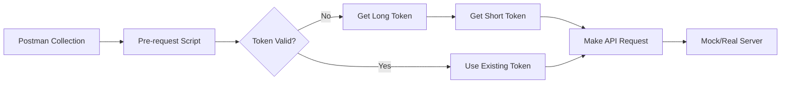
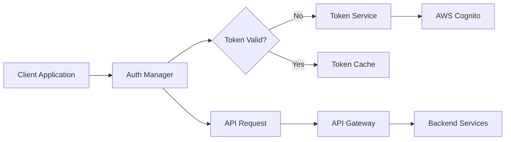

# Token Authorization: Postman vs Production Implementation Guide

## Table of Contents
1. [Overview](#overview)
2. [Architecture Comparison](#architecture-comparison)
3. [Postman Implementation](#postman-implementation)
4. [Production Implementation](#production-implementation)
5. [Implementation Examples](#implementation-examples)
6. [Security Considerations](#security-considerations)
7. [Best Practices](#best-practices)
8. [Troubleshooting Guide](#troubleshooting-guide)

## Overview

This document compares how JWT token-based authorization works in Postman (for testing) versus production environments, providing practical implementation examples for the C2M API v2.

### Key Concepts

The C2M API uses a two-token authentication system:
- **Long-term token** (30-90 days): Used to obtain short-term tokens
- **Short-term token** (15 minutes): Used for actual API requests

## Architecture Comparison

### Postman Environment



**Characteristics:**
- Pre-request scripts run automatically before each request
- Environment variables store tokens and credentials
- Visual interface for debugging
- Single-threaded execution
- Tokens stored in Postman's environment

### Production Environment



**Characteristics:**
- Multi-threaded/concurrent requests
- Token caching strategies required
- Error handling and retry logic
- Security considerations for token storage
- Performance optimization needs

## Postman Implementation

### Pre-request Script Setup

In Postman, authentication is handled by a pre-request script at the collection level:

```javascript
// postman/scripts/jwt-pre-request.js (simplified)
const config = {
    authUrl: pm.environment.get('authUrl'),
    clientId: pm.environment.get('clientId'),
    clientSecret: pm.environment.get('clientSecret')
};

// Skip auth for token endpoints
if (pm.request.url.getPath().includes('/auth/tokens/')) {
    console.log('Skipping auth for token endpoint');
    return;
}

// Check and refresh tokens
if (!pm.environment.get('shortTermToken') || isTokenExpired()) {
    await getLongTermToken();
    await getShortTermToken();
}

// Add auth header
pm.request.headers.add({
    key: 'Authorization',
    value: `Bearer ${pm.environment.get('shortTermToken')}`
});
```

### Environment Variables

```json
{
  "clientId": "test-client-123",
  "clientSecret": "super-secret-password-123",
  "authUrl": "https://api.gateway.url/dev",
  "baseUrl": "https://mock.server.url",
  "longTermToken": "",
  "shortTermToken": "",
  "tokenExpiry": ""
}
```

## Production Implementation

### 1. Backend Service Implementation (Node.js)

```javascript
// lib/c2m-client.js
const axios = require('axios');
const NodeCache = require('node-cache');

class C2MClient {
  constructor(config) {
    this.config = {
      authUrl: process.env.C2M_AUTH_URL || config.authUrl,
      apiUrl: process.env.C2M_API_URL || config.apiUrl,
      clientId: process.env.C2M_CLIENT_ID || config.clientId,
      clientSecret: process.env.C2M_CLIENT_SECRET || config.clientSecret,
      maxRetries: 3
    };
    
    // Token cache with TTL
    this.tokenCache = new NodeCache();
    this.requestQueue = [];
    this.isRefreshing = false;
  }

  async ensureAuthenticated() {
    // Check cache first
    const cachedToken = this.tokenCache.get('shortToken');
    if (cachedToken) {
      return cachedToken;
    }

    // Prevent multiple simultaneous token refreshes
    if (this.isRefreshing) {
      return new Promise((resolve) => {
        this.requestQueue.push(resolve);
      });
    }

    this.isRefreshing = true;
    
    try {
      // Get or refresh long token
      let longToken = this.tokenCache.get('longToken');
      if (!longToken) {
        longToken = await this.getLongToken();
      }

      // Get short token
      const shortToken = await this.getShortToken(longToken);
      
      // Notify waiting requests
      this.requestQueue.forEach(resolve => resolve(shortToken));
      this.requestQueue = [];
      
      return shortToken;
    } finally {
      this.isRefreshing = false;
    }
  }

  async getLongToken() {
    const response = await axios.post(`${this.config.authUrl}/auth/tokens/long`, {
      grant_type: 'client_credentials',
      client_id: this.config.clientId,
      client_secret: this.config.clientSecret,
      scopes: ['jobs:submit', 'jobs:read', 'templates:read'],
      ttl_seconds: 2592000 // 30 days
    });

    const { access_token, expires_at, token_id } = response.data;
    
    // Cache with TTL (expire 1 day before actual expiry)
    const ttl = Math.max(0, new Date(expires_at) - Date.now() - 86400000) / 1000;
    this.tokenCache.set('longToken', access_token, ttl);
    
    console.log(`Long-term token obtained: ${token_id}`);
    return access_token;
  }

  async getShortToken(longToken) {
    const response = await axios.post(
      `${this.config.authUrl}/auth/tokens/short`,
      { scopes: ['jobs:submit'] },
      {
        headers: {
          'Authorization': `Bearer ${longToken}`,
          'Content-Type': 'application/json'
        }
      }
    );

    const { access_token, expires_at, token_id } = response.data;
    
    // Cache with TTL (expire 1 minute before actual expiry)
    const ttl = Math.max(0, new Date(expires_at) - Date.now() - 60000) / 1000;
    this.tokenCache.set('shortToken', access_token, ttl);
    
    console.log(`Short-term token obtained: ${token_id}`);
    return access_token;
  }

  async makeRequest(method, endpoint, data, retries = 0) {
    try {
      const token = await this.ensureAuthenticated();
      
      const response = await axios({
        method,
        url: `${this.config.apiUrl}${endpoint}`,
        data,
        headers: {
          'Authorization': `Bearer ${token}`,
          'Content-Type': 'application/json'
        }
      });
      
      return response.data;
    } catch (error) {
      // Handle 401/403 by refreshing token
      if (error.response?.status === 401 || error.response?.status === 403) {
        if (retries < this.config.maxRetries) {
          // Clear token cache and retry
          this.tokenCache.del('shortToken');
          return this.makeRequest(method, endpoint, data, retries + 1);
        }
      }
      throw error;
    }
  }

  // Convenience methods
  async submitJob(jobData) {
    return this.makeRequest('POST', '/jobs/single-doc', jobData);
  }

  async getJob(jobId) {
    return this.makeRequest('GET', `/jobs/${jobId}`);
  }
}

// Usage
const client = new C2MClient({
  authUrl: 'https://api.click2mail.com/v2',
  apiUrl: 'https://api.click2mail.com/v2'
});

// Submit a job
const job = await client.submitJob({
  documentTemplate: { /* ... */ },
  recipientAddress: { /* ... */ }
});
```

### 2. Web Application Implementation (React)

```javascript
// src/services/c2m-auth.js
class C2MAuthService {
  constructor() {
    this.tokens = {
      long: null,
      short: null,
      shortExpiry: null
    };
    this.refreshPromise = null;
  }

  async initialize(clientId, clientSecret) {
    // In production, credentials should come from a secure backend
    // Never expose credentials in client-side code
    const response = await fetch('/api/auth/initialize', {
      method: 'POST',
      credentials: 'include',
      headers: { 'Content-Type': 'application/json' },
      body: JSON.stringify({ clientId, clientSecret })
    });
    
    const { sessionToken } = await response.json();
    this.sessionToken = sessionToken;
  }

  async getAuthHeader() {
    await this.ensureValidToken();
    return `Bearer ${this.tokens.short}`;
  }

  async ensureValidToken() {
    // Check if token is still valid (with 1 min buffer)
    const now = Date.now();
    const expiry = this.tokens.shortExpiry ? new Date(this.tokens.shortExpiry).getTime() : 0;
    
    if (this.tokens.short && expiry - now > 60000) {
      return;
    }

    // Prevent concurrent refreshes
    if (this.refreshPromise) {
      await this.refreshPromise;
      return;
    }

    this.refreshPromise = this.refreshToken();
    await this.refreshPromise;
    this.refreshPromise = null;
  }

  async refreshToken() {
    // Get token through backend proxy to keep credentials secure
    const response = await fetch('/api/auth/refresh', {
      method: 'POST',
      credentials: 'include',
      headers: {
        'Content-Type': 'application/json',
        'X-Session-Token': this.sessionToken
      }
    });

    if (!response.ok) {
      throw new Error('Failed to refresh token');
    }

    const { shortToken, expiresAt } = await response.json();
    this.tokens.short = shortToken;
    this.tokens.shortExpiry = expiresAt;
  }
}

// React Hook
export function useC2MApi() {
  const authService = useRef(new C2MAuthService());
  
  const makeRequest = useCallback(async (endpoint, options = {}) => {
    const authHeader = await authService.current.getAuthHeader();
    
    const response = await fetch(`/api/c2m/proxy${endpoint}`, {
      ...options,
      headers: {
        ...options.headers,
        'Authorization': authHeader
      }
    });
    
    if (!response.ok) {
      throw new Error(`API request failed: ${response.statusText}`);
    }
    
    return response.json();
  }, []);
  
  return { makeRequest };
}
```

### 3. Mobile App Implementation (Swift/iOS)

```swift
// C2MAuthManager.swift
import Foundation

class C2MAuthManager {
    private let keychain = KeychainService()
    private let authURL: String
    private let apiURL: String
    
    private var shortToken: String?
    private var shortTokenExpiry: Date?
    private var refreshTask: Task<String, Error>?
    
    init(authURL: String, apiURL: String) {
        self.authURL = authURL
        self.apiURL = apiURL
    }
    
    func configure(clientId: String, clientSecret: String) async throws {
        // Store credentials securely in keychain
        try keychain.store(clientId, for: "c2m_client_id")
        try keychain.store(clientSecret, for: "c2m_client_secret")
        
        // Get initial token
        _ = try await getValidToken()
    }
    
    func getValidToken() async throws -> String {
        // Check if current token is valid
        if let token = shortToken,
           let expiry = shortTokenExpiry,
           expiry.timeIntervalSinceNow > 60 {
            return token
        }
        
        // Prevent concurrent refreshes
        if let existingTask = refreshTask {
            return try await existingTask.value
        }
        
        // Create new refresh task
        let task = Task { () -> String in
            return try await refreshTokens()
        }
        refreshTask = task
        
        do {
            let token = try await task.value
            refreshTask = nil
            return token
        } catch {
            refreshTask = nil
            throw error
        }
    }
    
    private func refreshTokens() async throws -> String {
        // Get long token if needed
        var longToken = keychain.retrieve("c2m_long_token")
        if longToken == nil {
            longToken = try await fetchLongToken()
        }
        
        // Get short token
        return try await fetchShortToken(using: longToken!)
    }
    
    private func fetchLongToken() async throws -> String {
        guard let clientId = keychain.retrieve("c2m_client_id"),
              let clientSecret = keychain.retrieve("c2m_client_secret") else {
            throw AuthError.missingCredentials
        }
        
        let body = [
            "grant_type": "client_credentials",
            "client_id": clientId,
            "client_secret": clientSecret,
            "scopes": ["jobs:submit", "jobs:read"],
            "ttl_seconds": 2592000
        ] as [String: Any]
        
        let (data, _) = try await URLSession.shared.data(
            for: createRequest(
                url: "\(authURL)/auth/tokens/long",
                method: "POST",
                body: body
            )
        )
        
        let response = try JSONDecoder().decode(TokenResponse.self, from: data)
        keychain.store(response.accessToken, for: "c2m_long_token")
        
        return response.accessToken
    }
    
    // API Request Helper
    func makeAuthenticatedRequest<T: Decodable>(
        endpoint: String,
        method: String = "GET",
        body: Encodable? = nil
    ) async throws -> T {
        let token = try await getValidToken()
        
        var request = URLRequest(url: URL(string: "\(apiURL)\(endpoint)")!)
        request.httpMethod = method
        request.setValue("Bearer \(token)", forHTTPHeaderField: "Authorization")
        request.setValue("application/json", forHTTPHeaderField: "Content-Type")
        
        if let body = body {
            request.httpBody = try JSONEncoder().encode(body)
        }
        
        let (data, response) = try await URLSession.shared.data(for: request)
        
        // Handle 401/403 by clearing token and retrying
        if let httpResponse = response as? HTTPURLResponse,
           (httpResponse.statusCode == 401 || httpResponse.statusCode == 403) {
            shortToken = nil
            shortTokenExpiry = nil
            
            // Retry once with fresh token
            return try await makeAuthenticatedRequest(
                endpoint: endpoint,
                method: method,
                body: body
            )
        }
        
        return try JSONDecoder().decode(T.self, from: data)
    }
}
```

### 4. Python Implementation

```python
# c2m_client.py
import os
import time
import threading
from datetime import datetime, timedelta
from typing import Optional, Dict, Any
import requests
from cachetools import TTLCache

class C2MClient:
    def __init__(
        self,
        client_id: Optional[str] = None,
        client_secret: Optional[str] = None,
        auth_url: Optional[str] = None,
        api_url: Optional[str] = None
    ):
        self.client_id = client_id or os.getenv('C2M_CLIENT_ID')
        self.client_secret = client_secret or os.getenv('C2M_CLIENT_SECRET')
        self.auth_url = auth_url or os.getenv('C2M_AUTH_URL', 'https://api.click2mail.com/v2')
        self.api_url = api_url or os.getenv('C2M_API_URL', 'https://api.click2mail.com/v2')
        
        # Token cache with automatic expiration
        self._token_cache = TTLCache(maxsize=10, ttl=3600)
        self._refresh_lock = threading.Lock()
        self._refresh_in_progress = False
        
    def _get_long_token(self) -> Dict[str, Any]:
        """Obtain a long-term token from the auth service."""
        response = requests.post(
            f"{self.auth_url}/auth/tokens/long",
            json={
                "grant_type": "client_credentials",
                "client_id": self.client_id,
                "client_secret": self.client_secret,
                "scopes": ["jobs:submit", "jobs:read", "templates:read"],
                "ttl_seconds": 2592000  # 30 days
            }
        )
        response.raise_for_status()
        
        data = response.json()
        # Cache with TTL (1 day before expiry)
        expires_at = datetime.fromisoformat(data['expires_at'].replace('Z', '+00:00'))
        ttl = max(0, (expires_at - datetime.now()).total_seconds() - 86400)
        self._token_cache.setdefault('long_token', data['access_token'], ttl=ttl)
        
        return data
    
    def _get_short_token(self, long_token: str) -> Dict[str, Any]:
        """Exchange a long-term token for a short-term token."""
        response = requests.post(
            f"{self.auth_url}/auth/tokens/short",
            headers={
                "Authorization": f"Bearer {long_token}",
                "Content-Type": "application/json"
            },
            json={"scopes": ["jobs:submit"]}
        )
        response.raise_for_status()
        
        data = response.json()
        # Cache with TTL (1 minute before expiry)
        expires_at = datetime.fromisoformat(data['expires_at'].replace('Z', '+00:00'))
        ttl = max(0, (expires_at - datetime.now()).total_seconds() - 60)
        self._token_cache.setdefault('short_token', data['access_token'], ttl=ttl)
        
        return data
    
    def _ensure_authenticated(self) -> str:
        """Ensure we have a valid short-term token."""
        # Check cache first
        short_token = self._token_cache.get('short_token')
        if short_token:
            return short_token
        
        # Prevent multiple threads from refreshing simultaneously
        with self._refresh_lock:
            # Double-check after acquiring lock
            short_token = self._token_cache.get('short_token')
            if short_token:
                return short_token
            
            # Get or refresh long token
            long_token = self._token_cache.get('long_token')
            if not long_token:
                long_data = self._get_long_token()
                long_token = long_data['access_token']
            
            # Get short token
            short_data = self._get_short_token(long_token)
            return short_data['access_token']
    
    def request(
        self,
        method: str,
        endpoint: str,
        json: Optional[Dict[str, Any]] = None,
        **kwargs
    ) -> requests.Response:
        """Make an authenticated request to the API."""
        # Ensure we have a valid token
        token = self._ensure_authenticated()
        
        # Make the request
        headers = kwargs.pop('headers', {})
        headers['Authorization'] = f'Bearer {token}'
        headers['Content-Type'] = 'application/json'
        
        response = requests.request(
            method=method,
            url=f"{self.api_url}{endpoint}",
            headers=headers,
            json=json,
            **kwargs
        )
        
        # Handle token expiration
        if response.status_code in (401, 403):
            # Clear token and retry once
            self._token_cache.pop('short_token', None)
            token = self._ensure_authenticated()
            headers['Authorization'] = f'Bearer {token}'
            
            response = requests.request(
                method=method,
                url=f"{self.api_url}{endpoint}",
                headers=headers,
                json=json,
                **kwargs
            )
        
        response.raise_for_status()
        return response
    
    # Convenience methods
    def submit_job(self, job_data: Dict[str, Any]) -> Dict[str, Any]:
        """Submit a single document job."""
        return self.request('POST', '/jobs/single-doc', json=job_data).json()
    
    def get_job_status(self, job_id: str) -> Dict[str, Any]:
        """Get the status of a job."""
        return self.request('GET', f'/jobs/{job_id}').json()
    
    def list_templates(self) -> Dict[str, Any]:
        """List available templates."""
        return self.request('GET', '/templates').json()

# Usage example
if __name__ == "__main__":
    client = C2MClient()
    
    # Submit a job
    job = client.submit_job({
        "documentTemplate": {
            "id": "template123",
            "variables": {"name": "John Doe"}
        },
        "recipientAddress": {
            "name": "John Doe",
            "address1": "123 Main St",
            "city": "New York",
            "state": "NY",
            "zip": "10001"
        }
    })
    
    print(f"Job submitted: {job['job_id']}")
```

## Security Considerations

### Postman Security

1. **Environment Variables**
   - Marked as "secret" type for sensitive values
   - Not synced to Postman cloud by default
   - Should use separate environments for different stages

2. **Collection Sharing**
   - Remove sensitive data before sharing
   - Use variable placeholders
   - Document required environment setup

### Production Security

1. **Credential Storage**
   ```
   Development:
   - Environment variables
   - .env files (git-ignored)
   
   Production:
   - AWS Secrets Manager
   - HashiCorp Vault  
   - Azure Key Vault
   - Kubernetes Secrets
   ```

2. **Token Storage**
   ```
   Backend:
   - In-memory cache (Redis)
   - Encrypted database
   
   Frontend:
   - httpOnly secure cookies
   - Session storage (not localStorage)
   
   Mobile:
   - iOS: Keychain Services
   - Android: Android Keystore
   ```

3. **Network Security**
   - Always use HTTPS
   - Certificate pinning for mobile apps
   - Implement request signing for additional security

## Best Practices

### 1. Token Management

```javascript
// Good: Proactive token refresh
async function ensureValidToken() {
  const bufferTime = 60000; // 1 minute
  if (tokenExpiry - Date.now() < bufferTime) {
    await refreshToken();
  }
}

// Bad: Reactive token refresh only on 401
async function makeRequest() {
  try {
    return await apiCall();
  } catch (e) {
    if (e.status === 401) {
      await refreshToken();
      return await apiCall();
    }
  }
}
```

### 2. Error Handling

```javascript
// Comprehensive error handling
class APIError extends Error {
  constructor(message, code, details) {
    super(message);
    this.code = code;
    this.details = details;
  }
}

async function handleAPIRequest(request) {
  try {
    return await request();
  } catch (error) {
    if (error.response?.status === 401) {
      throw new APIError('Authentication failed', 'AUTH_FAILED', error.response.data);
    } else if (error.response?.status === 429) {
      throw new APIError('Rate limit exceeded', 'RATE_LIMITED', {
        retryAfter: error.response.headers['retry-after']
      });
    } else if (error.code === 'ECONNABORTED') {
      throw new APIError('Request timeout', 'TIMEOUT', { timeout: error.timeout });
    }
    throw error;
  }
}
```

### 3. Logging and Monitoring

```javascript
// Production logging
class C2MClient {
  async makeRequest(method, endpoint, data) {
    const requestId = generateRequestId();
    const startTime = Date.now();
    
    logger.info('API request started', {
      requestId,
      method,
      endpoint,
      timestamp: new Date().toISOString()
    });
    
    try {
      const response = await this._makeRequest(method, endpoint, data);
      
      logger.info('API request completed', {
        requestId,
        status: response.status,
        duration: Date.now() - startTime
      });
      
      return response;
    } catch (error) {
      logger.error('API request failed', {
        requestId,
        error: error.message,
        status: error.response?.status,
        duration: Date.now() - startTime
      });
      
      throw error;
    }
  }
}
```

## Troubleshooting Guide

### Common Issues and Solutions

| Issue | Postman | Production |
|-------|---------|------------|
| **401 Unauthorized** | - Check environment variables<br>- Verify pre-request script is running<br>- Check console for errors | - Verify credentials are correct<br>- Check token expiration logic<br>- Ensure proper header format |
| **403 Forbidden** | - Verify token has required scopes<br>- Check API endpoint permissions | - Review scope requirements<br>- Check rate limits<br>- Verify IP whitelisting |
| **Token Expired** | - Pre-request script should auto-refresh<br>- Manually clear tokens and retry | - Implement proactive refresh<br>- Add retry logic<br>- Monitor token expiry |
| **Concurrent Requests** | - Postman runs sequentially<br>- Not typically an issue | - Implement token refresh locking<br>- Queue requests during refresh<br>- Use connection pooling |
| **Network Errors** | - Check Postman proxy settings<br>- Verify SSL certificates | - Implement retry with backoff<br>- Add timeout handling<br>- Use circuit breakers |

### Debug Checklist

1. **Verify Credentials**
   ```bash
   # Test credentials directly
   curl -X POST https://api.click2mail.com/v2/auth/tokens/long \
     -H "Content-Type: application/json" \
     -d '{
       "grant_type": "client_credentials",
       "client_id": "YOUR_CLIENT_ID",
       "client_secret": "YOUR_CLIENT_SECRET"
     }'
   ```

2. **Check Token Format**
   ```javascript
   // Ensure proper header format
   console.log('Auth header:', `Bearer ${token}`);
   // Should be: "Bearer eyJhbGciOiJub25lIn0..."
   ```

3. **Monitor Token Lifecycle**
   ```javascript
   // Add logging to track token operations
   console.log('Token obtained:', {
     tokenId: response.token_id,
     expiresAt: response.expires_at,
     expiresIn: new Date(response.expires_at) - Date.now()
   });
   ```

## Migration Path: Postman to Production

### Step 1: Extract Configuration
Export from Postman environment:
- Auth URL
- Required scopes
- Token TTLs
- Error response formats

### Step 2: Implement Core Auth Logic
Start with the token management:
1. Long token acquisition
2. Short token exchange
3. Token caching
4. Refresh logic

### Step 3: Add Production Features
1. Concurrent request handling
2. Retry logic
3. Circuit breakers
4. Monitoring/logging

### Step 4: Security Hardening
1. Secure credential storage
2. Token encryption at rest
3. Request signing
4. Rate limiting

### Step 5: Testing
1. Unit tests for token management
2. Integration tests with mock server
3. Load testing for concurrency
4. Security testing

## Summary

While Postman provides a convenient testing environment with its pre-request scripts and environment variables, production implementations require more robust solutions including:

- **Proper credential management** using secure storage solutions
- **Concurrent request handling** with token refresh synchronization  
- **Comprehensive error handling** and retry logic
- **Performance optimization** through caching and connection pooling
- **Security hardening** appropriate for production environments
- **Monitoring and logging** for debugging and compliance

The key is to implement the same logical flow as the Postman pre-request script, but with production-grade reliability, security, and performance characteristics.