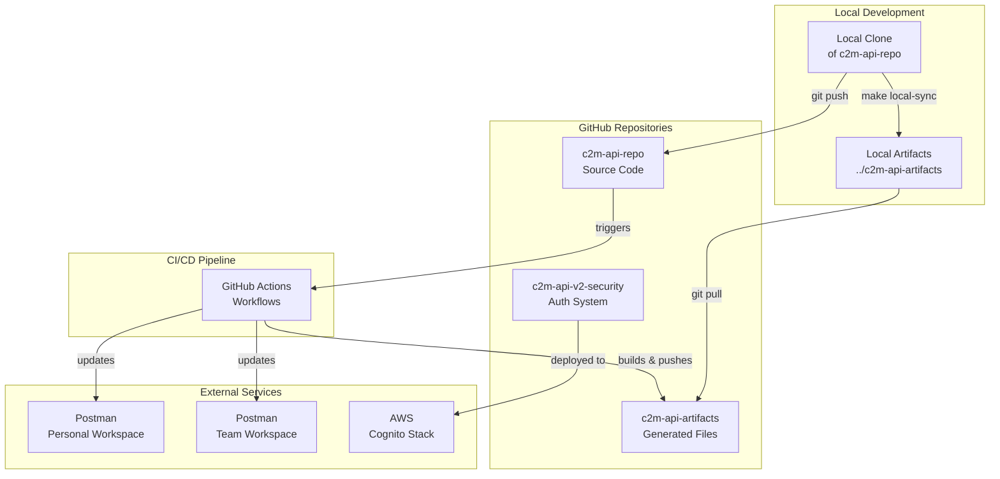
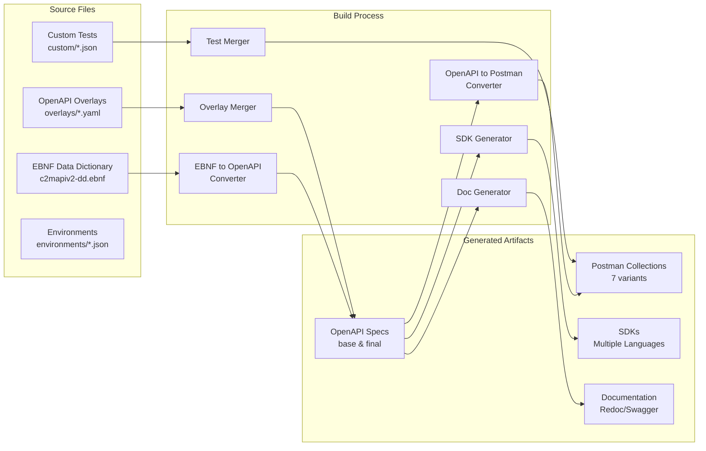
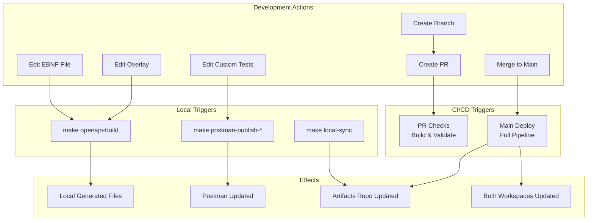
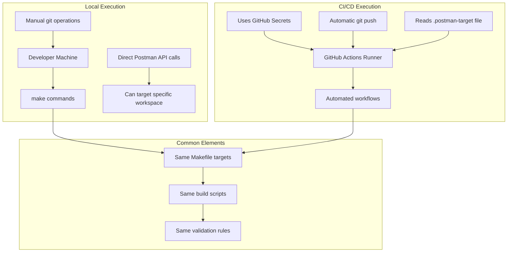
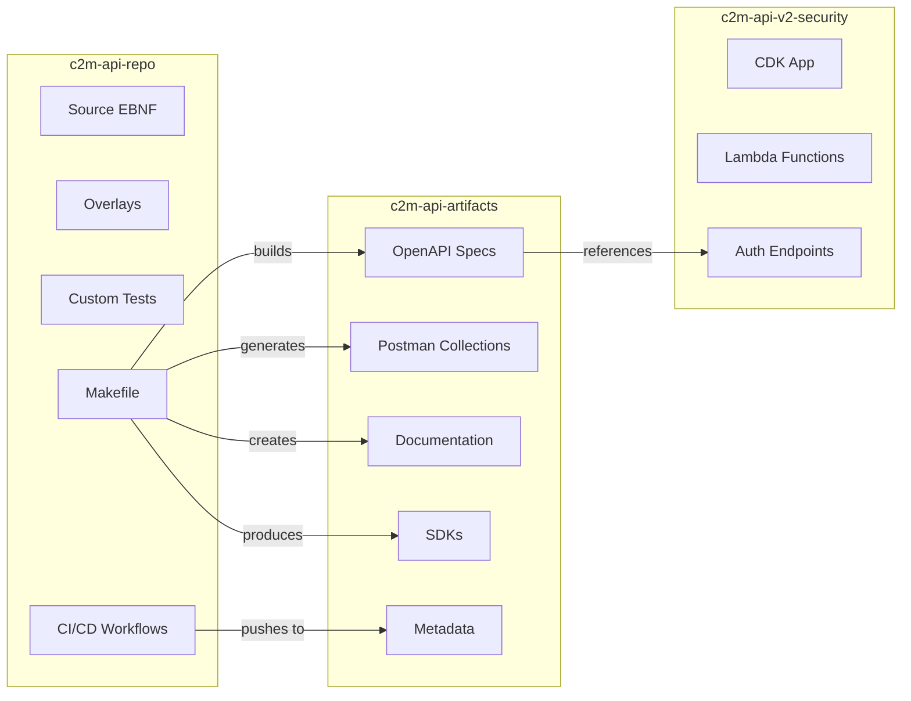

# C2M API Ecosystem Architecture Diagram

## High-Level Architecture



## Build Pipeline Flow



## Workflow Triggers



## Local vs CI/CD Execution



## Repository Relationships



## Key File Paths

```
Local Development:
├── c2m-api-repo/                    [Main working directory]
│   ├── data_dictionary/
│   │   └── c2mapiv2-dd.ebnf       [Source of truth]
│   ├── openapi/
│   │   └── overlays/              [Customizations]
│   ├── postman/
│   │   ├── custom/                [Test files]
│   │   └── environments/          [Env configs]
│   ├── scripts/                   [Build tools]
│   ├── Makefile                   [Orchestration]
│   └── .postman-target           [Workspace selector]
│
├── c2m-api-artifacts/             [Generated files]
│   ├── openapi/                   [Built specs]
│   ├── postman/                   [Built collections]
│   ├── docs/                      [Built docs]
│   └── sdks/                      [Built SDKs]
│
└── c2m-api-v2-security/          [Auth system]
    └── cognito-auth-app/         [CDK application]
```

## Environment Variables & Secrets

```yaml
Local (.env file):
  POSTMAN_SERRAO_API_KEY: Personal workspace key
  POSTMAN_C2M_API_KEY: Team workspace key

GitHub Secrets:
  POSTMAN_SERRAO_API_KEY: Personal workspace key
  POSTMAN_C2M_API_KEY: Team workspace key
  SECURITY_REPO_TOKEN: PAT for artifacts repo

Workspace IDs (in Makefile):
  Personal: d8a1f479-a2aa-4471-869e-b12feea0a98c
  Team: c740f0f4-0de2-4db3-8ab6-f8a0fa6fbeb1
```

## Common Commands Reference

```bash
# Local Development
make help                            # Show all targets
make openapi-build                   # Build OpenAPI only
make postman-collection-build        # Build Postman only
make postman-test-local             # Test with Prism
make postman-publish-personal       # Publish to personal
make postman-publish-team          # Publish to team
make postman-publish-both          # Publish to both
make local-sync                     # Sync to artifacts

# Full Pipeline
make postman-cleanup-all            # Clean everything
make postman-instance-build-and-test # Complete rebuild

# Debugging
make show-vars                      # Show variables
make postman-auth-test             # Test API keys
make artifacts-status              # Check sync status
```